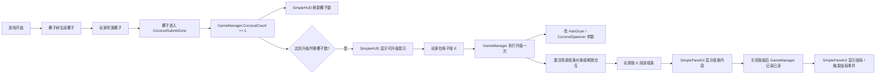

# CocoBlow MVP 开发计划

> 最后更新：2026-08-08  
> 状态：**最小闭环开发中**（「吹椰进池 → 升级一次 → 读纸条 → 结局」）

---

## 1. MVP 总目标

### 1.1 当前阶段目标（最小闭环）

用**最简单的方式**跑通从游戏开始到触发结局的完整循环，用于快速原型验证与团队测试：

```
游戏开始
  → 吹椰子进发光池（计数 +1）
  → 在椅子处升级一次
  → 解锁 / 激活场景中的纸条
  → 玩家阅读纸条
  → 触发结局事件（结局面板或场景表现）
```

**本阶段不要求：**

- 升级 3 次
- 触发 3 次异常事件
- 阅读 3 张纸条
- 完整教程、SO 架构、事件总线、对象池

**本阶段要求：**

- 循环可重复演示（Play 模式内能走通一遍）
- 逻辑集中、脚本少、Inspector 可配
- 跑通后再扩展「3 升级 / 3 纸条 / 异常 / 黑暗区」等内容

### 1.2 闭环跑通后的扩展目标

最小闭环验收通过后，再按节奏扩展为完整垂直切片：

- 3 档主升级（5 / 12 / 20 椰子等）
- 每次升级改吹风机 / 椰子树参数 + 解锁 1 张纸条 + 1 个简单异常
- 读完关键纸条后进入正式结局
- 可选：DarkZone 黑暗倒计时

---

## 2. 设计原则（保持不变）

| 原则 | 说明 |
|------|------|
| 脚本少、逻辑集中 | 可接受 `GameManager` 暂时偏大，但分区清晰 |
| Inspector 配置 | 升级节点、纸条内容等先用数组/字段，不做 SO |
| 直接引用调用 | 不做事件总线；`GameManager` 调 UI / 吹风机 / Spawner |
| 每个脚本对应可玩功能 | 不提前创建「以后可能会用」的空脚本 |
| 稳定后再拆 | GameManager > ~300 行再拆 UpgradeManager 等 |

### 推荐目录（可渐进整理）

```
Assets/Scripts/
├── Player/          FirstPersonController（待移入）
├── Coconut/         Coconut, CoconutSpawner, CoconutSpawnPoint  ✅
├── Game/            GameManager（待移入）
├── UI/              SimpleHUD, SimplePanelUI（待建/移入）
├── Interactables/   ChairInteract, NoteInteract（待建）
└── Environment/     DarkZone 等（后续）
```

MVP 期不强制搬目录；**先跑通闭环再整理**。

---

## 3. 当前进度（截至 2026-08-08）

### 3.1 已完成 ✅

| 模块 | 内容 |
|------|------|
| 玩家 | `FirstPersonController`：移动、视角、E 拾取 / G 放下吹风机 |
| 吹风机 | `HairDryer`：风锥物理、吹挂树椰子、吹落地面椰子 |
| 风锥可视化 | `HairDryerRangeVisual`：Range / Angle 可视化（策划调参用） |
| 椰子 | `Coconut`：挂树 kinematic、累计风力吹落、防冲天（释放偏下 + 0.3s 风冷却） |
| 椰子树 | `CoconutSpawner` + 5×`CoconutSpawnPoint`：固定挂点生成、统一参数 |
| 提交 | `CoconutSubmitZone` → `GameManager.AddCoconut()` |
| 全局数据 | `GameManager`：`CoconutCount` 唯一数据源 |
| HUD | `SimpleHUD`：椰子数量显示；升级提示 / 黑暗倒计时**接口已预留** |
| 文档 | `Docs/CoconutBlow-测试调试指南.md`、`Docs/CoconutBlow-策划调试简版.md` |

**当前可玩范围：** 树上长椰 → 吹落 → 滚进池 → HUD 椰子数 +1。

### 3.2 未完成（最小闭环所需）❌

| 模块 | 说明 |
|------|------|
| 椅子升级 | 无 `ChairInteract`；`GameManager` 无升级逻辑 |
| 升级效果 | 未改 `HairDryer` / `CoconutSpawner` 参数 |
| 纸条 | 无 `NoteInteract`、无场景纸条交互 |
| 结局面板 | 无 `SimplePanelUI`、无结局触发 |
| 异常事件 | 本阶段**不做**（完整版再做） |

### 3.3 场景遗留 / 待清理 ⚠️

- `BouncyBall`：早期测试球，闭环完成后可删
- `UpgradeHintText` / `DarkCountdownText`：场景已有 UI 节点，逻辑未接
- `HairDryer.windForce` 等：场景值与脚本默认差异大，见策划调试文档

---

## 4. 最小闭环：数据流



---

## 5. 最小闭环：脚本清单

### 5.1 已有（仅需扩展）

| 脚本 | 最小闭环中要加什么 |
|------|-------------------|
| `GameManager.cs` | 升级条件判断、`TryUpgrade()`、扣椰子（可选）、调用 Spawner/HairDryer 改参、解锁纸条、记录已读、触发结局 |
| `SimpleHUD.cs` | `ShowUpgradeHint(true/false)` 与 GameManager 联动（接口已有） |
| `HairDryer.cs` | 公开 setter 或 `ApplyUpgrade(windForce, range, angle)` |
| `CoconutSpawner.cs` | 已有 `SetSpawnInterval` / `SetMaxActiveCoconuts`，升级时调用即可 |

### 5.2 待新建

| 脚本 | 职责 |
|------|------|
| `ChairInteract.cs` | 玩家 E 交互 → `GameManager.TryUpgrade()` |
| `NoteInteract.cs` | 玩家 E 交互 → `SimplePanelUI.ShowNote(text)` → 通知 GameManager 已读 |
| `SimplePanelUI.cs` | 统一显示纸条面板、结局面板；关闭纸条时回调 GameManager |

### 5.3 本阶段不做

- `DarkZone.cs`、`SimpleHorrorEvent.cs`、`PlayerRespawnPoint.cs`
- 多纸条数组驱动（先 **1 张纸条 + 1 次升级**）
- ScriptableObject、事件通道、Director 分层

---

## 6. 最小闭环：GameManager 配置（Inspector）

在 `GameManager` 上用一个**升级节点**即可（完整版再扩成数组）：

| 字段 | 建议初值 | 说明 |
|------|----------|------|
| `upgradeRequiredCoconuts` | `3` 或 `5` | 达到后可升级（测试用，可调低） |
| `consumeCoconutsOnUpgrade` | `true` / `false` | 升级是否扣除椰子（MVP 可先不扣） |
| `windForceAfterUpgrade` | 如 `35` | 升级后吹风机风力 |
| `windRangeAfterUpgrade` | 如 `10` | 升级后射程 |
| `spawnIntervalAfterUpgrade` | 如 `5` | 升级后生成间隔 |
| `noteToUnlock` | 场景纸条 GameObject | 升级后 `SetActive(true)` 或启用 `NoteInteract` |
| `endingTriggered` | bool | 已读纸条后为 true，弹结局 |

纸条内容可先用 `[TextArea] string noteContent` 写在 `NoteInteract` 或 `GameManager` 上。

---

## 7. 最小闭环：推荐实现顺序

| 顺序 | 任务 | 验收 |
|------|------|------|
| **0** | （已完成）吹椰进池 + HUD | 椰子数 +1 |
| **1** | `GameManager`：`CanUpgrade` / `TryUpgrade()`，达到椰子数时 HUD 显示升级提示 | 够椰子时出现「可升级」 |
| **2** | `ChairInteract` + 场景椅子 Collider/占位 | 按 E 触发升级，提示消失 |
| **3** | 升级时调用 `HairDryer`、`CoconutSpawner` 改参 | 风变大或椰子变密（能感知即可） |
| **4** | 升级时激活场景纸条（或启用 `NoteInteract`） | 纸条可交互 |
| **5** | `SimplePanelUI`：纸条面板 + `NoteInteract` | 按 E 弹出文字，关闭面板 |
| **6** | `GameManager.OnNoteRead()` → `SimplePanelUI.ShowEnding()` | 读完后出现结局 UI 或 Log |
| **7** | 联调：从 Play 到结局走通一遍 | 团队可重复演示 |

**PR 建议：** 步骤 1–3 一个 PR，步骤 4–6 一个 PR，避免「PR 爆炸」。

---

## 8. 最小闭环：验收标准

- [ ] 玩家能移动、拾取吹风机、吹落树上椰子
- [ ] 椰子进池后 `GameManager` 计数，HUD 同步
- [ ] 达到设定椰子数后，HUD 提示可升级
- [ ] 椅子处按 E 完成**一次**升级，玩法参数有可见变化
- [ ] 升级后场景纸条可阅读（面板显示内容）
- [ ] 阅读关闭后触发**结局**（面板或简单全屏 UI）
- [ ] 全程无必须依赖的异常事件 / 第二张纸条 / 第二次升级

---

## 9. 闭环跑通后的扩展路线

按原完整 MVP 节奏迭代，**在现有脚本上扩展数组**，不推倒重来：

| 阶段 | 内容 |
|------|------|
| v0.2 | 3 档升级节点（5 / 12 / 20），每档改参 + 解锁 1 纸条 |
| v0.3 | 每次升级触发 1 个简单异常（灯闪、音效、物体出现） |
| v0.4 | 3 张纸条都读后进入完整结局演出 |
| v0.5 | `DarkZone` + HUD 黑暗倒计时（增强项） |
| 重构 | GameManager 超 300 行 → 拆 `UpgradeManager` / `NoteManager`；数据迁 SO |

---

## 10. 暂不做的内容（两阶段均不做）

- 完整 SO 数据驱动架构
- SO 事件通道
- Director / Service / RuntimeState 分层
- 对象池（除非性能问题）
- 完整教程系统（仅简单 HUD 文案）
- 复杂异常事件调度系统
- 正式美术资源依赖（占位 UI / 基础物体即可）

---

## 11. 相关文档

| 文档 | 用途 |
|------|------|
| [CoconutBlow-策划调试简版.md](./CoconutBlow-策划调试简版.md) | 策划调吹风机 / 椰子 / RangeVisual |
| [CoconutBlow-测试调试指南.md](./CoconutBlow-测试调试指南.md) | QA 详细参数表与测试用例 |

---

## 12. 变更记录

| 日期 | 变更 |
|------|------|
| 2026-08-07 | 初版计划：完整垂直切片（3 升级 / 3 纸条） |
| 2026-08-07 | 完成：椰子树生成、吹落、进池、HUD、防冲天、风锥可视化 |
| 2026-08-08 | **修订 MVP 目标**：优先最小闭环（1 升级 + 1 纸条 + 1 结局）；完整 3 档内容延后至闭环跑通后 |
